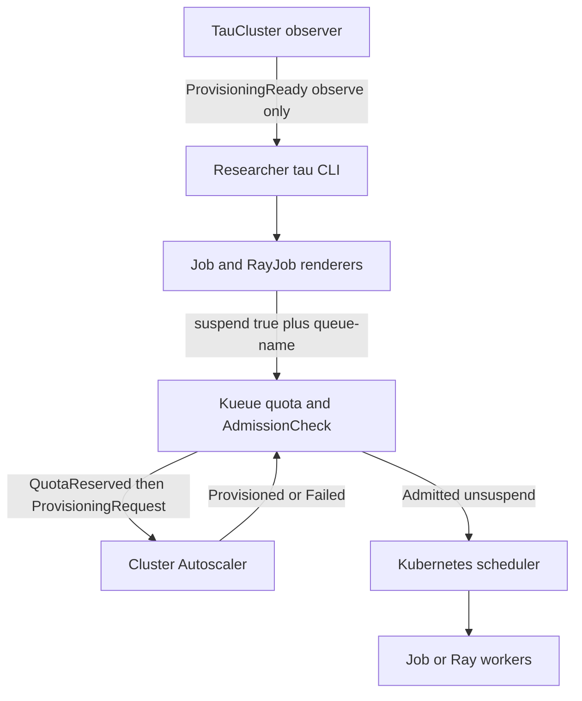
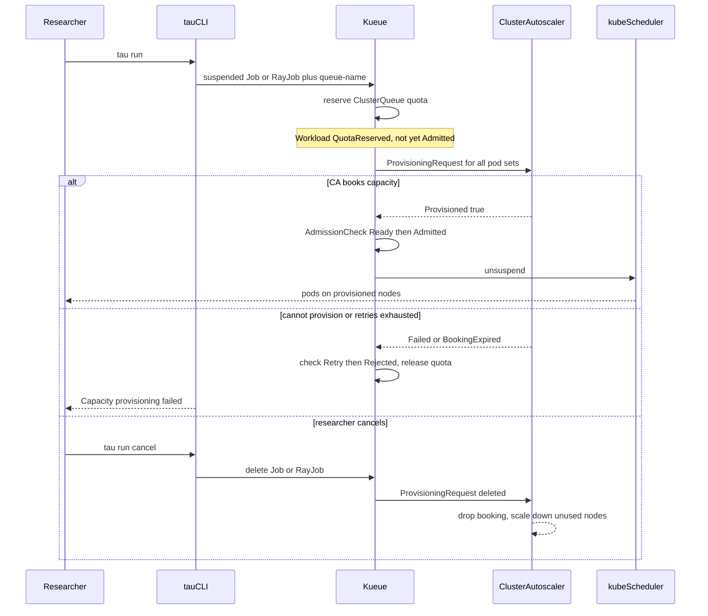

# Capacity-aware Kueue admission with Cluster Autoscaler

Status: **proposal, awaiting review.** No implementation code is written yet.

GitHub: [#278](https://github.com/Azure/taugrid/issues/278)

Scope: a TauGrid system contract so Kueue admission accounts for capacity that
Cluster Autoscaler must provision. Researchers keep `tau run` / `status` /
`cancel`. Platform teams enable a queue/flavor gate. TauGrid does not create
node pools.

Primary integration: **AKS managed Cluster Autoscaler** via Kueue's
ProvisioningRequest AdmissionCheck. Secondary: Kind with Cluster Autoscaler
ProvisioningRequest enabled, for a thin prototype.

This is a **workflow and lifecycle design**. It is not a TauGrid autoscaler,
not a replacement for Kueue or the Kubernetes scheduler, and not cluster
provisioning ([ROADMAP.md](../../ROADMAP.md) "Not planned").

## Decisions already made (do not re-litigate)

| # | Decision | Consequence |
|---|---|---|
| D1 | **Reuse Kueue ProvisioningRequest AdmissionCheck.** Controller name is exactly `kueue.x-k8s.io/provisioning-request`. | TauGrid does not create `ProvisioningRequest` objects. Kueue 0.19.2 already ships the controller. |
| D2 | **No new researcher `tau.yaml` fields in v1.** Capacity-aware admission is a platform queue/flavor property. | `policy.profile` / LocalQueue selection is unchanged. |
| D3 | **No new `executionTarget`.** Keep `singleCluster`. | Do not add `executionTarget: provisioning`. Workload profiles stay free of live capacity. |
| D4 | **MultiKueue stays disjoint.** Mixing MultiKueue and ProvisioningRequest on one ClusterQueue remains invalid. | v1 is single-cluster only. Cross-cluster capacity-aware dispatch is a later design. |
| D5 | **Default install stays quota-only.** Helm opt-in enables the AdmissionCheck and `ProvisioningRequestConfig`. | Existing clusters do not change admission behavior until an operator turns the gate on. |
| D6 | **First AKS provisioning class is `best-effort-atomic-scale-up.autoscaling.x-k8s.io`.** | Matches [AKS Kueue + cluster autoscaler](https://learn.microsoft.com/en-us/azure/aks/configure-kueue-with-cluster-autoscaler). `check-capacity.autoscaling.x-k8s.io` only tests existing nodes and is not sufficient for scale-from-zero. |

---

## 1. Context

### 1.1 User problem

TauGrid admits Jobs and RayJobs through Kueue using quota, ResourceFlavors,
topology, and priority. Quota is **logical**. It is not proof that Cluster
Autoscaler can create the matching nodes.

Today a workload can:

1. Reserve ClusterQueue quota.
2. Become `Admitted` and unsuspend.
3. Leave pods Pending while AKS scales.
4. For a multi-pod Job or Ray head+worker set, occupy quota with only partial
   physical capacity and no admission-time success/failure.

Researchers then see `Admitted (no active pods yet)` and cannot tell queue
wait from scale-up wait from a capacity that will never appear.

### 1.2 What already exists (verified)

| Claim | Evidence |
|---|---|
| Jobs render `suspend: true` and `kueue.x-k8s.io/queue-name` | [`cli/internal/jobrender/render.go`](../../cli/internal/jobrender/render.go) lines 13–15, 1016–1018 |
| RayJobs render `suspend: true` and the same queue label | [`cli/internal/rayjobrender/render.go`](../../cli/internal/rayjobrender/render.go) lines 361, 473 |
| Kueue is pinned at 0.19.2 | [`charts/taugrid/Chart.yaml`](../../charts/taugrid/Chart.yaml) dependency `kueue` 0.19.2; [`charts/taugrid/values.yaml`](../../charts/taugrid/values.yaml) image tag `v0.19.2` |
| MultiKueue controller support is on by default | [`charts/taugrid/values.yaml`](../../charts/taugrid/values.yaml) `kueue.aksExtension.enableMultiKueue: true` |
| `TauCluster` observes MultiKueue AdmissionChecks as a first-class capability | [`ConditionMultiKueueReady`](../../controllers/tau-core/api/v1alpha1/types.go) line 41; [`multikueue_prerequisites.go`](../../controllers/tau-core/internal/controller/multikueue_prerequisites.go) |
| ProvisioningRequest controller is only classified as `otherChecks` | [`workload_profile_observer.go`](../../controllers/tau-core/internal/controller/workload_profile_observer.go) lines 22, 349–353, 403–419 |
| Mixing MultiKueue + ProvisioningRequest fails MultiKueue wiring | [`workload_profile_observer_test.go`](../../controllers/tau-core/internal/controller/workload_profile_observer_test.go) "mixed wiring" case, lines 308–315 |
| Startup phases are Submitted → Kueue admission → (MultiKueue) → pods | [`core/status/phases.go`](../../core/status/phases.go) `startupPhasesAt`, lines 60–80 |
| Generic AdmissionCheck Rejected does **not** fail `tau run status --watch` | [`cli/internal/cli/run_lifecycle_test.go`](../../cli/internal/cli/run_lifecycle_test.go) `TestWatchStatusCommand_GenericAdmissionChecksDoNotTriggerMultiKueueTermination` |
| Tests mention both `kueue.x-k8s.io/provisioning` and `.../provisioning-request` | observer test uses `provisioning-request`; several `core/status` tests use `provisioning` |
| `executionTarget` is only `singleCluster` or `multiKueue` | [`core/resourceprofile/workload.go`](../../core/resourceprofile/workload.go) lines 29–30, 66–68 |
| Terraform GPU pool autoscaling allows `min_count >= 0` | [`terraform/aks/variables.tf`](../../terraform/aks/variables.tf) `gpu_auto_scaling_enabled`, `gpu_min_count` |
| Helm has no ProvisioningRequestConfig / provisioning AdmissionCheck | no matches under `charts/` |
| E2E already covers Kueue gang admission, not CA | [`tests/e2e/kueue/kueue_test.go`](../../tests/e2e/kueue/kueue_test.go) |

### 1.3 Upstream contract we are binding to

Kueue admission with a ProvisioningRequest AdmissionCheck is two sequential
checks ([Kueue ProvisioningRequest](https://kueue.sigs.k8s.io/docs/concepts/admission_check/provisioning_request/)):

1. **Quota reservation** — ClusterQueue flavors, topology, priority.
2. **Capacity guarantee** — Kueue creates a namespaced `ProvisioningRequest`
   owned by the Workload. Cluster Autoscaler sets `Provisioned`, `Failed`,
   `BookingExpired`, or `CapacityRevoked`. The Workload is `Admitted` only when
   the AdmissionCheck is `Ready`.

AKS documents this path for managed Cluster Autoscaler:
[Configure Kueue with the cluster autoscaler on AKS](https://learn.microsoft.com/en-us/azure/aks/configure-kueue-with-cluster-autoscaler).
Jobs stay `suspend: true`. Kueue creates the ProvisioningRequest. AKS CA
satisfies it with `best-effort-atomic-scale-up.autoscaling.x-k8s.io`. The job
unsuspends after the pool grows.

---

## 2. First supported Cluster Autoscaler environment

Spike conclusion for this design:

**AKS managed Cluster Autoscaler does reconcile `autoscaling.x-k8s.io`
ProvisioningRequest objects** when the node pool has the cluster autoscaler
enabled. Microsoft documents the Kueue AdmissionCheck + ProvisioningRequestConfig
+ atomic scale-up class as the supported pairing. Operators do not set
`--enable-provisioning-requests` themselves; AKS runs CA in the managed control
plane.

| Environment | v1 status | Notes |
|---|---|---|
| **AKS managed CA + autoscaling node pool** | First supported integration | Use `best-effort-atomic-scale-up.autoscaling.x-k8s.io`. Confirm the pool `min_count`/`max_count` can absorb the gang. Flavor `nodeLabels` must match AKS `agentpool=<pool>`. |
| Kind + Cluster Autoscaler with `--enable-provisioning-requests=true` | Prototype / CI-adjacent | Requires CA 1.30.1+ and the ProvisioningRequest CRD. Used for the thin prototype if a real AKS pool is unavailable. |
| Kind stub ProvisioningRequest controller | CI-required subset | Flips `Provisioned`/`Failed` without creating nodes. Proves TauGrid observation and status, not CA. |
| Karpenter / other ProvisioningRequest classes | Out of v1 | Same TauGrid observation surface later; different `provisioningClassName`. |
| Pending-pod scale-up without ProvisioningRequest | **Not this feature** | That is today's accidental behavior after admit. Do not document it as capacity-aware admission. |

`check-capacity.autoscaling.x-k8s.io` only asks whether **current** nodes can
fit the request. It is useful for "do not scale" flavors, not for
scale-from-zero.

Terraform already exposes `gpu_auto_scaling_enabled` and `gpu_min_count >= 0`.
Turning those on is **necessary but not sufficient**: the ClusterQueue must also
reference the provisioning AdmissionCheck, or Kueue will still admit on quota
alone.

---

## 3. User experience and system contract

### 3.1 Researcher

No new config keys. A checked-in target still looks like:

```yaml
name: train
engine: rayjob
entrypoint: train.py
compute:
  workers: 2
  gpus_per_worker: 1
policy:
  gpu_class: any
```

Commands stay:

```bash
tau run --config tau.yaml
tau run status train --watch
tau run cancel train
```

What changes is **status**. After Submitted and Kueue quota reservation, a new
phase appears before pod scheduling:

```text
Startup phases:
  ✓  Submitted                 Job/RayJob applied
  ✓  Kueue admission           quota reserved
  …  Capacity provisioning     waiting for Cluster Autoscaler (ProvisioningRequest)
  ·  Pod scheduling            —
```

Success: Capacity provisioning becomes `done`, the Job/RayJob unsuspends, then
the existing pod phases run.

Failure: Capacity provisioning becomes `warning`/`failed` with the AdmissionCheck
message (`Failed`, `CapacityIsNotFound`, retry exhausted). Quota is released.
The watch exits. The researcher does **not** see a green Kueue admission with
Pending pods.

Cancel: `tau run cancel` deletes the Job/RayJob. Kueue deletes the Workload.
The ProvisioningRequest owner-ref goes with it. CA drops the booking.

### 3.2 Platform engineer

Enable autoscaling on the worker pool, install the opt-in Helm objects, point
the scale-from-zero ResourceFlavor at that pool, and attach the AdmissionCheck
with `admissionChecksStrategy.onFlavors`. Default `jobqueue` may stay quota-only
so CPU-only smoke tests do not wait on CA.

`tau cluster` / `TauCluster.status.conditions[ProvisioningReady]` reports
whether the referenced AdmissionCheck is Active and its
`ProvisioningRequestConfig` resolves. Missing or stale wiring fails closed for
profiles that use those queues, same as MultiKueue.

### 3.3 What "admitted" means after this design

| State | Quota | Physical capacity | Pods |
|---|---|---|---|
| Pending (no reservation) | not held | n/a | none (still suspended) |
| QuotaReserved, check Pending | held | CA in progress | none |
| QuotaReserved, check Retry | released after backoff starts | n/a | none |
| QuotaReserved, check Rejected | released | will not appear | none; watch fails |
| Admitted | held | Provisioned=True | unsuspended; scheduler places |

Admitted again means "allowed to run on booked capacity," not "quota math
succeeded."

---

## 4. Ownership boundaries



| Layer | Owns | Does not own |
|---|---|---|
| TauGrid CLI / renderers | Resolve workspace and profile; emit suspended Job/RayJob; new Capacity provisioning phase; cancel deletes the owner | Creating nodes; creating ProvisioningRequests; AKS VMSS APIs |
| TauCluster controller | Observe AdmissionCheck + ProvisioningRequestConfig; publish `ProvisioningReady`; fail-closed profile status | Reconciling ProvisioningRequest CRs; scaling pools |
| Kueue | Quota, flavor, topology, priority; create/sync ProvisioningRequest; admit only when check Ready | Node placement; cloud inventory |
| Kubernetes scheduler | Place unsuspended pods (optionally pinned by `podSetUpdates`) | Scaling node pools |
| Cluster Autoscaler | Create/delete nodes for the ProvisioningRequest; set Provisioned/Failed/BookingExpired | Queue fairness, researcher UX |
| GPU health (NPD/UNO) | Drain/taint unhealthy GPUs after they exist | Admission-time capacity |

TauGrid remains the workflow layer. Kueue remains admission. CA remains
provisioning. Kubernetes remains scheduling.

---

## 5. Sequence



A multi-node RayJob is one Workload with head and worker pod sets. Kueue
merges similar templates when `podSetMergePolicy` is set. CA must satisfy the
**whole** request before Ready. The Ray head must not unsuspend without
workers.

---

## 6. API and configuration examples

### 6.1 ProvisioningRequestConfig and AdmissionCheck

```yaml
apiVersion: kueue.x-k8s.io/v1beta2
kind: ProvisioningRequestConfig
metadata:
  name: taugrid-cas-cpu
spec:
  provisioningClassName: best-effort-atomic-scale-up.autoscaling.x-k8s.io
  managedResources:
    - cpu
    - memory
  retryStrategy:
    backoffLimitCount: 2
    backoffBaseSeconds: 60
    backoffMaxSeconds: 1800
  podSetMergePolicy: IdenticalWorkloadSchedulingRequirements
---
apiVersion: kueue.x-k8s.io/v1beta2
kind: AdmissionCheck
metadata:
  name: taugrid-cas-provisioning
spec:
  controllerName: kueue.x-k8s.io/provisioning-request
  parameters:
    apiGroup: kueue.x-k8s.io
    kind: ProvisioningRequestConfig
    name: taugrid-cas-cpu
```

GPU flavors use `managedResources: [nvidia.com/gpu]` (and CPU/memory if the
same flavor covers them). Optional `podSetUpdates.nodeSelector` pins pods to
nodes CA labeled for this request so leftover nodes cannot steal a partial
gang.

Canonical controller name in TauGrid code and tests: **`kueue.x-k8s.io/provisioning-request`**.
Stop using the truncated `kueue.x-k8s.io/provisioning` string in new tests.

### 6.2 ClusterQueue strategy (flavor-scoped)

```yaml
apiVersion: kueue.x-k8s.io/v1beta2
kind: ClusterQueue
metadata:
  name: jobqueue
spec:
  admissionChecksStrategy:
    admissionChecks:
      - name: taugrid-cas-provisioning
        onFlavors: [taugrid-scale-cpu]
  resourceGroups:
    - coveredResources: [cpu, memory]
      flavors:
        - name: taugrid-default-cpu
          resources:
            - name: cpu
              nominalQuota: "32"
            - name: memory
              nominalQuota: 64Gi
        - name: taugrid-scale-cpu
          resources:
            - name: cpu
              nominalQuota: "32"
            - name: memory
              nominalQuota: 64Gi
```

Workloads that land on `taugrid-default-cpu` skip CA. Workloads that need the
scale-from-zero flavor wait for Provisioned. This is how Kind CPU smoke tests
and scale-from-zero research queues can share one ClusterQueue.

Do not attach this AdmissionCheck to a MultiKueue ClusterQueue
([`usesOnlyMultiKueue`](../../controllers/tau-core/internal/controller/workload_profile_observer.go)
already rejects mixed wiring).

### 6.3 ResourceFlavor aligned with AKS / Terraform

AKS labels user pools `agentpool=<pool name>`. TauGrid Terraform names the GPU
pool from `gpu_node_pool_name` (default `gpu`) and already supports
`gpu_min_count = 0`.

```yaml
apiVersion: kueue.x-k8s.io/v1beta2
kind: ResourceFlavor
metadata:
  name: taugrid-scale-cpu
spec:
  nodeLabels:
    agentpool: cpu
```

The flavor must not advertise a GPU class label unless the pool is a GPU pool.
See [policy and placement](../../site/content/en/docs/platform-admin-guide/policy-and-placement.md).

### 6.4 Helm opt-in (follow-up implementation)

Proposed values, default off:

```yaml
# charts/taugrid-core or charts/taugrid — exact chart decided at implementation
capacityAwareAdmission:
  enabled: false
  admissionCheckName: taugrid-cas-provisioning
  provisioningRequestConfigName: taugrid-cas-cpu
  provisioningClassName: best-effort-atomic-scale-up.autoscaling.x-k8s.io
  managedResources: [cpu, memory]
  onFlavors: [taugrid-scale-cpu]
  retryStrategy:
    backoffLimitCount: 2
    backoffBaseSeconds: 60
    backoffMaxSeconds: 1800
```

Templates create `ProvisioningRequestConfig`, `AdmissionCheck`, and merge
`admissionChecksStrategy` only when `enabled: true`. ClusterQueue GitOps that
already sets `admissionChecks` must not also set `admissionChecksStrategy`
(Kueue allows only one of the two).

Kueue's provisioning controller is enabled by default in current Kueue; TauGrid
does not need a new feature gate in `managerConfig` unless the vendored chart
disables it.

### 6.5 TauCluster condition (follow-up implementation)

Add beside `ConditionMultiKueueReady` in
[`controllers/tau-core/api/v1alpha1/types.go`](../../controllers/tau-core/api/v1alpha1/types.go):

```go
ConditionProvisioningReady = "ProvisioningReady"
```

Meaning:

- `True` — at least one Active AdmissionCheck with
  `controllerName=kueue.x-k8s.io/provisioning-request` exists, its
  `ProvisioningRequestConfig` GET succeeds, and `provisioningClassName` is
  non-empty.
- `False` / `Unknown` — referenced but missing, unreadable, inactive, or
  config missing. Fail closed for profiles whose ClusterQueue lists that check.

Do **not** require `ProvisioningReady=True` for every `singleCluster` profile.
Only profiles whose resolved ClusterQueue references a provisioning check must
see that check Active (same pattern as MultiKueue: unexpected MultiKueue wiring
fails; absence of MultiKueue wiring is fine for `singleCluster`).

Workload profiles themselves do not grow a capacity field. Live quota and
capacity stay in status observations
([`WorkloadProfile` comment](../../core/resourceprofile/workload.go) lines 48–49).

---

## 7. Controller reconciliation boundaries

| Controller | Watches | Writes | Idle when |
|---|---|---|---|
| TauCluster (`observeWorkloadProfiles` / new provisioning observer) | AdmissionCheck, ProvisioningRequestConfig, ClusterQueue | `TauCluster.status` only | Always observe; never create ProvReq |
| Kueue provisioning AC controller | Workload with QuotaReserved + this AC | ProvisioningRequest, Workload.admissionChecks | Quota not reserved |
| Cluster Autoscaler | ProvisioningRequest | Node groups; ProvReq conditions | No ProvReq / CA disabled |
| kube-scheduler | unsuspended pods | bindings | Job still suspended |
| TauGrid CLI | nothing (client) | Job/RayJob create/delete | n/a |

TauCluster must GET `ProvisioningRequestConfig` the same fail-closed way it
already GETs AdmissionChecks ([observer lines 373–391](../../controllers/tau-core/internal/controller/workload_profile_observer.go)).
Classify `kueue.x-k8s.io/provisioning-request` into `provisioningChecks` instead
of `otherChecks`. Require Active=True for those checks when a `singleCluster`
profile's queue references them.

Do not have tau-core reconcile `autoscaling.x-k8s.io` CRs.

---

## 8. CLI, status, and lifecycle fit

### 8.1 New startup phase

Insert **Capacity provisioning** in
[`core/status/phases.go`](../../core/status/phases.go) after `kueuePhase` and
before MultiKueue placement / RayCluster / pod phases.

Show the phase when any hydrated AdmissionCheck has
`ControllerName == "kueue.x-k8s.io/provisioning-request"` (or lookup-failed
fallback only if the check **name** is the installed `taugrid-cas-provisioning`
name — do not treat the string `provisioning` as MultiKueue does with
`multikueue`).

| Check state | Phase status | Detail |
|---|---|---|
| absent | skipped | quota-only queue |
| Pending | active | waiting for Cluster Autoscaler |
| Ready | done | capacity booked |
| Retry | active (or warning if message present) | quota released; backing off |
| Rejected | warning | failed; watch must fail |

### 8.2 Watch termination (behavior change)

Today a generic Rejected AdmissionCheck does **not** stop `--watch`
([`run_lifecycle_test.go`](../../cli/internal/cli/run_lifecycle_test.go) line 344).
That was to avoid treating non-MultiKueue checks as placement failure.

After this design, `WatchFailed` must return true when a **provisioning-request**
check is Rejected, analogous to MultiKueue Rejected. Other generic checks stay
non-fatal until they have their own phase.

`WatchComplete` must not treat QuotaReserved + Pending provisioning as complete.

### 8.3 Renderers

No renderer change required for v1. Suspend + queue-name is the Kueue
ProvisioningRequest contract (AKS sample Job is the same shape TauGrid already
emits).

Optional later: copy `provreq.kueue.x-k8s.io/ValidUntilSeconds` from run
`resilience` onto the Job. Not v1; CA + `retryStrategy` already bound the wait.

Do not embed ProvisioningRequest YAML in `jobrender` / `rayjobrender`.

### 8.4 Cancel and retry

- Cancel: existing delete of Job/RayJob. Owner-ref cleanup is Kueue/CA.
- After admit, `CapacityRevoked` / eviction: existing
  `resilience.retry_on: [Preempted, Evicted]`
  ([recovery docs](../../site/content/en/docs/platform-admin-guide/troubleshooting-guides/recovery.md)).
- Do not auto-retry AdmissionCheck Rejected through `resilience.*`; that is an
  admission failure, not a running-pod eviction. The user resubmits after
  capacity policy changes.

---

## 9. Failure-mode analysis

| Scenario | Expected result | Who signals it |
|---|---|---|
| Scale-from-zero success | QuotaReserved → Provisioned → Admitted → pods schedule | CA Provisioned, Kueue Ready |
| Request exceeds `--max-count` | `CapacityIsNotFound`; job stays suspended; retries; then Rejected | AKS CA; TauGrid phase warning |
| Cloud SKU / quota exhaustion | Failed; quota released on Retry/Rejected | CA Failed |
| Timeout / booking window | BookingExpired; check Retry; quota released | CA; Kueue retryStrategy |
| Cancel mid-scale | Owner deleted; ProvReq gone; unused nodes scale down after CA unneeded-time | CLI cancel + CA |
| Partial gang (Ray head vs workers) | Single ProvReq for merged pod sets; no unsuspend until all booked | Kueue podSetMergePolicy |
| Flavor/node label mismatch | Provisioned but pods Pending at scheduling layer | existing Pod scheduling phase — not a Kueue success story |
| Unhealthy GPU after scale-up | Drain/taint; possible later eviction | GPU health layer, not admission |
| CA not processing ProvReq (empty conditions) | Phase stays active; operator checks pool autoscaler enabled | AKS troubleshooting table |
| MultiKueue + provisioning on one CQ | Profile `MultiKueueWiringNotReady` | existing observer |
| Default Helm (gate off) | Today's quota-only admit | D5 |

Silent "Admitted with Pending pods waiting for CA" is the failure mode this
design exists to eliminate.

---

## 10. Alternatives considered

| Alternative | Why not v1 |
|---|---|
| Kueue `waitForPodsReady` after admit | Still consumes quota; allows partial pods; not an admission-time result |
| Placeholder / pause Jobs | Exactly the manual glue #278 says users must not run |
| TauGrid controller → Azure VMSS / node pools | Cluster provisioning; forbidden by ROADMAP |
| Oversize ClusterQueue to `max_count` | Today's bug: logical quota ≠ creatable nodes |
| New `executionTarget: provisioning` | Queue/flavor property of `singleCluster`; profiles must not store live capacity |
| `check-capacity` class only | Cannot scale from zero |
| Karpenter ProvisioningRequest class | Different provisioner; reuse the same TauGrid observation later |
| Classic pending-pod CA without ProvReq | Admits first, scales second; gang can split |

---

## 11. Thin end-to-end prototype

The prototype is specified here and implemented in a **follow-up PR**, not in
the design-only change.

Goal: start with **insufficient or zero worker capacity**, submit **both** a
Kubernetes Job and a multi-node RayJob through Kueue, observe autoscaler
behavior, and demonstrate **success, timeout, cancellation, and cleanup**.

### 11.1 Environments

1. **CI (required):** stub ProvisioningRequest controller in
   [`tests/e2e/kueue`](../../tests/e2e/kueue) (or a sibling package) that
   watches ProvReqs and sets `Provisioned=True` or `Failed=True`. No real nodes.
   Unit tests cover the new status phase and profile observer.
2. **Kind recipe (documented):** Cluster Autoscaler 1.30.2+ with
   `--enable-provisioning-requests=true`, a scalable node group, CPU-only.
3. **AKS CPU pool (optional operator lab):** `min_count=0` or `1`,
   `max_count>=3`, class `best-effort-atomic-scale-up.autoscaling.x-k8s.io`,
   following the AKS sample. GPU scale-from-zero is **not** the thin prototype.

### 11.2 Workloads

- **Job:** Indexed or parallelism=3 CPU Job, `suspend: true`,
  `kueue.x-k8s.io/queue-name` pointing at the gated LocalQueue. Requests large
  enough that they cannot all fit on the starting node (AKS sample uses
  `cpu: 1800m` on a 1-node pool).
- **RayJob:** head + `replicas: 2` workers (or 2-node TauGrid `compute.workers`),
  same queue, CPU-only image already used in examples. `podSetMergePolicy:
  IdenticalWorkloadSchedulingRequirements` so CA sees one atomic request.

Submit with `tau run` once the renderers are unchanged; YAML apply is
acceptable for the first Kind recipe if CLI install is out of band.

### 11.3 Paths

**Success**

1. Worker pool at 0 or 1 node; quota configured for the full gang.
2. Submit Job; wait until `Capacity provisioning` is done and Job Complete.
3. Scale pool back (or wait for CA scale-down).
4. Submit the RayJob; wait until Admitted, RayCluster ready, job Complete.
5. Assert no leftover ProvisioningRequests; Ray TTL released head/worker pods
   ([`rayJobTTLSecondsAfterFinished = 15`](../../cli/internal/rayjobrender/render.go)).

**Timeout / cannot provision**

1. Set `max_count` below the gang, or stub controller sets `Failed=True`.
2. Submit Job.
3. `tau run status --watch` exits failed at Capacity provisioning.
4. ClusterQueue `admittedWorkloads` does not include this job; a second smaller
   job can admit.

**Cancel**

1. Submit RayJob; wait until ProvisioningRequest exists and is not yet
   Provisioned (stub can delay).
2. `tau run cancel`.
3. Job/RayJob gone; ProvisioningRequest gone; no unsuspended partial Ray
   cluster; stub/CA not left with a booking for a deleted owner.

**Cleanup**

After each path: zero orphaned ProvisioningRequests in the workspace
namespace, zero pause/placeholder Jobs, LocalQueue not wedged.

### 11.4 Stub controller sketch (CI)

A tiny Go controller or `kubectl` loop in the e2e harness:

- List `provisioningrequests.autoscaling.x-k8s.io`.
- If annotation `e2e.taugrid.dev/outcome=fail`, set `Failed=True`.
- Else after a bounded sleep, set `Provisioned=True`.
- Ignore objects whose owner Workload is gone.

This proves TauGrid status and Kueue AC plumbing when CA is absent. It does
**not** prove AKS atomic scale-up.

---

## 12. Follow-up implementation checklist

Not part of the design-only PR.

1. Helm opt-in: `ProvisioningRequestConfig` + `AdmissionCheck` + optional
   ClusterQueue `admissionChecksStrategy`.
2. [`workload_profile_observer.go`](../../controllers/tau-core/internal/controller/workload_profile_observer.go):
   `provisioningChecks`; validate config; `ProvisioningReady` condition.
3. [`core/status/phases.go`](../../core/status/phases.go): Capacity provisioning
   phase; `WatchFailed` on provisioning Rejected.
4. Canonical controller constant `kueue.x-k8s.io/provisioning-request` in
   status and tests; retire `.../provisioning` fixtures.
5. Site docs: [kueue.md](../../site/content/en/docs/getting-started/core-technologies/kueue.md)
   and troubleshooting layer 4 (queue admission vs capacity provisioning).
6. Terraform notes: `gpu_auto_scaling_enabled` / CPU pool min=0 plus flavor
   `agentpool` labels.
7. Prototype: CI stub + Kind/AKS CPU recipe as in section 11.
8. `python3 scripts/check-license-headers.py` on new source files.
9. Keep MultiKueue mixed-wiring tests; add provisioning-ready tests.

---

## 13. Open questions for review

1. Should the default `onFlavors` list be empty (gate every flavor on that
   ClusterQueue) or require an explicit scale flavor? This design recommends
   **explicit `onFlavors`** so default CPU flavors stay quota-only.
2. Should `ProvisioningReady` be cluster-wide (any Active provisioning AC) or
   per-profile only? This design recommends **cluster-wide condition plus
   per-profile fail-closed when the profile's CQ references a provisioning
   check**, matching MultiKueue.
3. GPU scale-from-zero e2e is deferred; is an AKS GPU lab a v1.1 requirement
   before declaring the feature GA?
