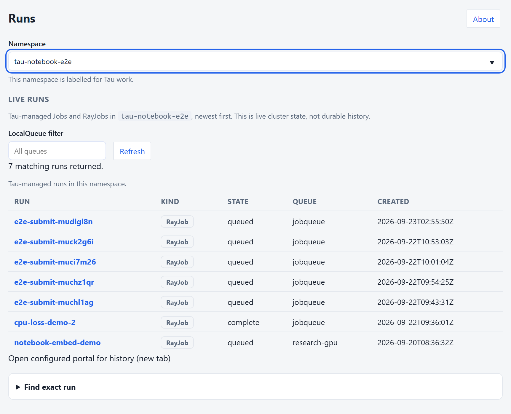
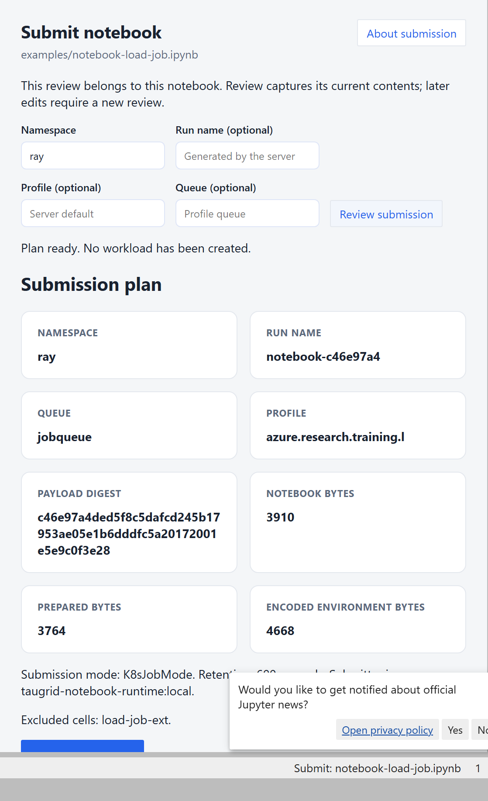
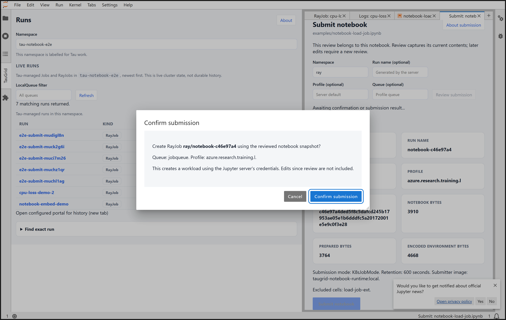
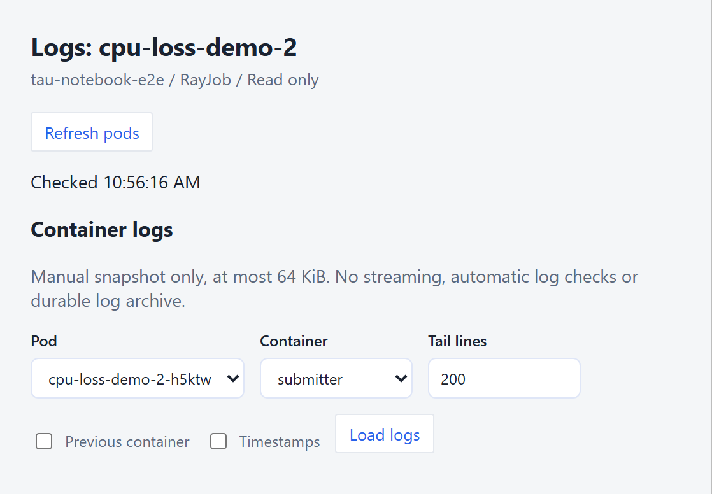
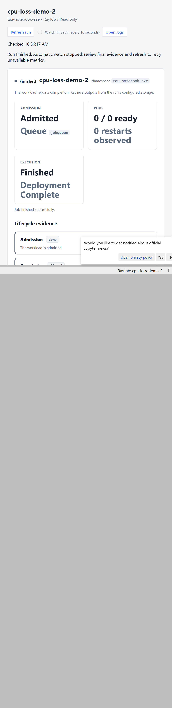

# Notebook plugin design

This document describes the native notebook plugin implemented in this repository.
It is a design contract, not a record of test runs or a production certification.

## Contents

1. [Context and scope](#1-context-and-scope)
2. [Decisions](#2-decisions)
3. [Architecture and API](#3-architecture-and-api)
4. [Surfaces and placement](#4-surfaces-and-placement)
5. [Submission journey](#5-submission-journey)
6. [Companion files](#6-companion-files)
7. [Embedded transport and execution](#7-embedded-transport-and-execution)
8. [Run evidence and logs](#8-run-evidence-and-logs)
9. [Loss evidence](#9-loss-evidence)
10. [Identity and security](#10-identity-and-security)
11. [Packaging and release](#11-packaging-and-release)
12. [Test posture and anchors](#12-test-posture-and-anchors)
13. [Deferred work](#13-deferred-work)
14. [Design history](#14-design-history)

## 1. Context and scope

A researcher already has a Python notebook open. Moving that work to a queued
cluster run should not require exporting a script, learning Kubernetes YAML,
opening a terminal, or adding a launcher cell. Those steps split the experiment
from its submission and make it harder to tell what actually ran.

The plugin's one job is to let that researcher review and submit the notebook,
then inspect admission, execution, logs, and observed loss without leaving
Jupyter. It also lets an engineer inspect an existing Tau-managed Job or RayJob.
Platform operators supply profiles, queues, credentials, and a notebook-capable
runtime. This is not a cluster administration UI or a durable experiment store.

## 2. Decisions

| Decision | Rationale and consequence |
|---|---|
| No runtime `tau` or `kubectl` subprocess | The native path uses Python Kubernetes clients. It does not require a CLI binary or inherit shell parsing and subprocess state. Other SDK execution APIs remain separate. |
| No researcher Tau import or YAML | The toolbar captures the open notebook model. Cluster-provided choices and server rendering replace a researcher-authored manifest. |
| The notebook is the job | Submit a prepared copy of its code, not a tiny smoke script or a launcher standing in for the experiment. Execution starts in a fresh kernel; local variables are not transferred. |
| A JupyterLab 4 prebuilt extension, shipped in the `tau` wheel | Native sidebar, toolbar, dialogs, and tabs fit the host workspace. Notebook 7 is the compatible frontend target; classic Notebook 6 is outside scope. Actual activation in both hosts requires live verification. |
| Browser API traffic goes only to Jupyter Server | Kubernetes and optional portal-series reads run server-side. A configured portal hyperlink opens another page; it is not a browser-side data integration. |
| Submission is gated and plan-first | Review is read-only. An operator enables writes, the researcher confirms a specific receipt, and the server rejects a changed rendered plan before creating anything. |

## 3. Architecture and API

Python and frontend source paths in this document are relative to
`sdk/python/python/`, unless identified as repository-root paths. Generated
runtime files and wheel installation destinations are identified separately.

| Module | Responsibility |
|---|---|
| `labextension/src/index.ts`, `labextension/src/widget.tsx` | Register commands, toolbar, sidebar, dialogs, and identity-scoped tabs; restore run tabs. |
| `labextension/src/submitview.tsx`, `labextension/src/submissionui.tsx`, `labextension/src/submission.ts`, `labextension/src/destinations.ts` | Destination/file choices, receipt, confirmation, snapshot and write state. |
| `labextension/src/api.ts`, `labextension/src/model.ts`, `labextension/src/snapshot.ts`, `labextension/src/monitor.ts` | Base-URL-aware requests, response validation, cancellation, snapshot replacement, and polling. |
| `labextension/src/explorer.tsx`, `labextension/src/view.tsx`, `labextension/src/loss.tsx` | Discovery, logs, lifecycle/diagnostics, and loss rendering. |
| `tau/jupyter/server.py`, `tau/jupyter/__init__.py` | Authenticated HTTP handlers, request validation, client lifetime, and extension registration. |
| `tau/jupyter/destinations.py`, `tau/jupyter/notebook_files.py`, `tau/jupyter/submit.py` | Bounded choices, server-local companion files, and native submission policy. |
| `tau/_notebook_submit.py`, `tau/_notebook_pkg.py`, `tau/_profile.py`, `tau/_render.py`, `tau/_payload.py`, `tau/_backend.py` | Shared package, resolve, render, encode, and create pipeline. |
| `tau/jupyter/runs.py`, `tau/jupyter/metrics.py`, `tau/_kube_io.py`, `tau/widgets/kube.py`, `tau/widgets/status.py` | Kubernetes clients and bounded reads, run classification, ownership, logs, and metrics collection. Reuse does not make the native UI an ipywidgets panel. |

The following routes sit under Jupyter's configured base URL. All require
Jupyter authentication; the browser uses `ServerConnection`, not a separate
Kubernetes credential store.

| Method and route | Contract |
|---|---|
| `GET /taugrid/api/capabilities` | Submission availability and configured portal link. |
| `GET /taugrid/api/namespaces` | Bounded namespace discovery with Tau workspace hints. |
| `GET /taugrid/api/destinations` | Visible namespaces, resolved profiles, and LocalQueues for the selected `namespace`. |
| `GET /taugrid/api/files` | Flat companion-file candidates beside notebook `path`. |
| `GET /taugrid/api/runs` | Tau-managed runs in `namespace`, optionally filtered by `queue`. |
| `GET /taugrid/api/status` | Exact `namespace`, `kind`, and `name`; `includeMetrics=true` opts into loss collection. Default metrics collection is off. |
| `GET /taugrid/api/logs` | Exact run plus `pod`, `container`, `tail`, `previous`, and `timestamps`; bounded snapshot, never a stream. |
| `POST /taugrid/api/preview` | Validate notebook and selections, read cluster configuration/files, and return a resolved plan without creating a run. This is not an offline operation. |
| `POST /taugrid/api/submit` | Require the gate, `confirm=true`, and matching `planDigest`; rebuild and create the RayJob. |

Submission flows from notebook model to review UI, preview handler, shared
package/resolve/render code, confirmation, then the create backend. Status flows
from a run tab to the status handler, workload/admission/pod reads, optional
metrics collection, validated response, and evidence rendering. Log reads use
their own endpoint and tab. Request-owned Kubernetes clients disable retries
and close after use; blocking cluster work runs off Tornado's event loop.

## 4. Surfaces and placement

| Surface | Capabilities and placement rationale |
|---|---|
| Left runs sidebar | Namespace input/datalist, queue filter, bounded run table, refresh, and exact lookup. Discovery stays available beside notebooks; it does not contain a submit form or an embedded monitor. |
| Per-run detail tab | Identity, lifecycle phases, admission, pods, diagnostics, loss, recorded output metadata, status JSON, and an Open logs action. Evidence needs main-area width and stays scoped to one run. |
| Per-run logs tab | Verified pod/container choices and explicit snapshot controls. Raw output does not crowd the lifecycle or loss view. |
| Notebook toolbar and command palette | **Submit notebook** and **TauGrid: Submit current notebook** open a review tab tied to the originating notebook. Submission belongs to the notebook, not the runs sidebar. |
| About dialog | Server identity, submission capability/gate, and portal configuration. Operational constraints remain discoverable without dominating each run. |

The palette command **TauGrid: Open runs** and the launcher entry open the
sidebar. Detail and logs tabs are reused by namespace, kind, name, and surface;
this UI key is not a workload UID or an evidence-ownership check.

The runs sidebar keeps discovery beside the active notebook.

## 5. Submission journey

### Choose a destination

Opening review requests destinations from the cluster, not a hard-coded catalog.
The server lists at most 500 namespaces, resolves at most 200 profiles from the
sole TauCluster, and reads at most 500 LocalQueues in the selected namespace.
It does not follow continuation tokens or fan out across namespace queues.
Missing permissions, incomplete lists, and unavailable profiles remain visible.

Namespaces carrying `tau.azure.com/workspace` sort first, but this label is only
a discovery hint. The researcher explicitly chooses a worker profile. The UI
shows workers, GPUs/CPUs/memory per worker, priority, image, and queue consequences;
these are requests, not promises of capacity or admission. The shared resolver
uses an explicit queue, then the workspace default, then `default`. The native
picker selects a default only if it appears among visible LocalQueues; it never
invents a selectable queue. Per-profile queue selection is not implemented.

### Review an execution receipt

**Review submission** captures the current in-memory notebook JSON, including
unsaved edits, plus the selected options and file names. It does not read a
saved notebook off disk. The review remains tied to its originating notebook;
closing or renaming that notebook prevents a new capture through that handle.

The server validates a Python notebook, strips outputs and execution counts,
and removes explicit launcher cells or narrowly recognized Tau-only launcher
code. It preserves mixed cells containing real work. Packaging is in memory;
native preview does not leave a staging directory. Companion files come from
the server filesystem, as described in section 6.

The receipt shows the resolved namespace/name, profile/queue, resource requests,
runtime image, original and prepared notebook bytes, every packaged file's size,
both transport budgets, excluded cells, and execution/cleanup policy. It shows
`K8sJobMode`, shutdown after completion, and 600-second post-finish retention.
Expandable details expose both the payload digest and rendered-plan digest.
These details describe a future create, not a reservation or a running workload.

Cluster choices lead to a receipt of what runs, what ships, and what is cleaned up.

Changing namespace, name, profile, queue, or file selection invalidates review.
Refreshing files clears selections and review. Editing the notebook after review
does not mutate the captured snapshot; review again to include those edits.

### Confirm, create, and hand off

The review action, confirmation dialog, and accept button use **Submit notebook**.
The dialog names the destination and explains server credentials and snapshot
semantics. Cancel creates nothing. Controls prevent overlapping confirmation or
submission, and unavailable capabilities never enable writing.

Confirmation names the notebook and destination rather than introducing another
submission vocabulary.

The request sends the captured notebook/options, resolved identity, `confirm=true`,
and `planDigest`. The server rebuilds the plan, including rereading selected
files and current cluster configuration, and compares the digest before writing.
A changed image, profile, file, or other rendered field produces HTTP 409.
The backend creates once; it does not replace an existing name or pre-read to
simulate uniqueness. Kubernetes create supplies the conflict decision.

Success says **Notebook submitted** and shows the exact namespace/name. It proves
creation, not queue admission or execution. **Open submitted run** opens its
detail tab; submission does not automatically navigate away from the receipt.

### Failures have a next action

| Failure | Recovery presented to the researcher |
|---|---|
| File discovery fails | Check server-local path/permissions and refresh, or explicitly choose **Continue without companion files**. Never silently omit selected inputs. |
| HTTP 400 | Correct the notebook or selections and review again. |
| HTTP 401/403 | Sign in again or ask the operator about server identity/RBAC. |
| HTTP 413 | Remove companion files, reduce notebook content/outputs, or move assets into the image; review again. Outputs are stripped during preparation, but still count against raw input limits. |
| HTTP 409 | Disabled gate: ask the operator. Changed plan: review again. Existing name: inspect that run instead of blindly retrying. |
| Server, network, or response failure | Retry a read when safe; a failed write response does not prove that no resource was created. |

Once the browser attempts the submit POST, **any** failure enters uncertain-write
state, even an HTTP rejection. It consumes the old review, retains the attempted
identity, and never retries automatically. **Inspect planned run** opens that
identity. Only after that action does **I checked; allow another review** become
available. This acknowledgement is a user decision, not proof of absence or an
idempotency guarantee. Aborting or closing a tab cannot roll back a server create.

## 6. Companion files

`GET /taugrid/api/files` inspects files beside the notebook's server-local path.
The picker supports search, opt-in selection, sizes, and possible-import hints;
it does not perform dependency closure or recursively package a project.
The directory scan examines the first 200 entries before sorting candidates and
reports incomplete discovery. Hidden names, directories, selected binary/archive
suffixes, the notebook itself, and files over 256 KiB are not offered.

The server expands and resolves the notebook path, then requires its parent
directory to be inside the resolved Jupyter server root. Submitted file names
must be flat basenames, not traversal or nested paths. Each selected file is
limited to 256 KiB and their aggregate to 1 MiB. Generated package files and
encoding overhead impose the stricter final budgets in section 7. Reserved
generated-file names cannot be overwritten by a companion file.

This is a directory-containment check, **not a complete filesystem sandbox**.
Selected files are opened by joining their names to that directory; normal file
operations follow symlinks, without separately confining each resolved target.
The picker's suffix exclusions are not a server-side file-type authorization
rule. Shared-server operators must not treat either check as tenant isolation.

The runner copies non-hidden companion files from the payload into its working
directory before execution, so relative imports and file reads can find them.
Nested trees, packages, and large datasets belong in a prepared image or storage
such as a PVC, not this envelope. The native review does not provision or select
a PVC; its rendered working directory is ephemeral, as detailed next.

## 7. Embedded transport and execution

`tau/_payload.py` implements the same transport contract as repository-root
`cli/internal/payload/payload.go`: envelope version 2 contains sorted flat files
with base64-encoded contents. Compact JSON is gzip-compressed with a fixed
timestamp, then base64-encoded. The payload digest is SHA-256 of the compressed
bytes before outer base64 encoding. The package's encoded bytes are fixed for
the reviewed plan; submission cannot silently substitute newly encoded content.
This is format/contract parity, not a claim of byte-identical Go/Python gzip
output or full CLI execution parity.

| Boundary | Enforced limit or rule |
|---|---|
| Raw notebook input | 10 MiB before preparation. |
| Encoded environment entry | 64 KiB for `TAU_PAYLOAD_B64=<encoded>`: name, equals sign, and value; not just the value. |
| Decoded package | 1 MiB summed file bytes, including generated notebook, runner, context, and companions. |
| Payload integrity | `TAU_PAYLOAD_DIGEST` and annotation `tau.azure.com/payload-digest` identify the encoded payload. |
| Plan consistency | `planDigest` is SHA-256 of the canonical rendered manifest, not merely the notebook bytes. |

The package contains `analysis.ipynb`, `_tau_runner.py`, and
`_tau_notebook_context.json`, plus selected companions. These are generated
payload paths, not repository files. The `tau-payload` init container verifies
the digest and envelope version and validates flat names before writing to
`/script`. The manifest embeds the payload and mounts the shared volume on the
Ray head and K8sJobMode submitter. Workers do not receive that payload mount.

Embedding keeps code with the workload object that MultiKueue can mirror; it
avoids depending on a separately copied ConfigMap or an object-store upload and
its credentials. It is intentionally a small-code transport, not general storage.

The rendered RayJob starts suspended for Kueue, with a control-only Ray head and
profile-sized workers. Native policy is `K8sJobMode` with 600-second retention;
the shared legacy path retains `HTTPMode` and 15 seconds. The submitter submits
to Ray and forwards remote driver output. It is not itself the notebook kernel;
actual driver/log placement still needs live KubeRay verification.

The runner executes `/script/analysis.ipynb` with working directory `/data` using
nbconvert, forwards cell stdout/stderr, and writes
`/data/analysis.executed.ipynb`. Its execution preprocessor has a 600-second
timeout setting, not an end-to-end queue/run deadline. Missing notebook executor
dependencies produce an actionable failure. In the current renderer `/data` is
an `emptyDir`, despite the internal constant's durable-sounding name. It is not
persistent storage, and the plugin does not download the executed notebook.

## 8. Run evidence and logs

Discovery lists Jobs and RayJobs carrying a `tau.azure.com/` label, with a
500-object bound per kind and an optional queue filter. It hides RayJob-owned
submitter Jobs from the top-level list. Partial lists, pagination, and read
failures produce warnings; the server does not walk every page. Exact lookup
remains useful when a known run is not in the discovery window. A Tau workspace
namespace label helps discovery; it does not establish admission readiness.

The detail view separates admission, cluster, pods, and execution. Kueue
admission evidence comes from the Workload controlling-owner UID, with RayJob
admission status as a fallback. Pending admission is not failed execution;
ready pods are not proof that notebook code completed. MultiKueue-managed runs
can lack remote execution evidence in the local cluster. The UI reports that
boundary instead of inventing remote progress. A terminal RayJob whose
RayCluster has already been cleaned up is not reclassified as failed merely
because the cluster lookup returns 404.

Ownership, not a matching name or label, determines supporting evidence:

| Evidence | Required relationship |
|---|---|
| Workload admission | Controlling owner matches workload kind and UID; ambiguous matches stay unknown. |
| Job pods | Controlling Job owner UID matches the requested Job. |
| RayCluster and its pods | Cluster is controlled by the RayJob UID; pods are controlled by that cluster UID. |
| RayJob submitter Job and pods | Job is controlled by the RayJob UID; pods are controlled by that Job UID. |
| Log read | Workload, pod, controller chain, and container membership are checked before and after reading. |

Pod diagnostics expose role, readiness, restarts, and node placement. The logs
selector exposes containers, including init containers. Diagnostics retain
unavailable or failed reads
rather than translating them into successful lifecycle phases. UID checks
narrow replacement races; they do not make several Kubernetes reads an atomic
snapshot. The output fields read `tau.azure.com/result-path` and
`tau.azure.com/result-pvc` annotations. These are declared locations, not proof
that an artifact or PVC exists.

Detail watching polls every 10 seconds without overlapping requests. It stops
on terminal state or error and pauses after one hour until explicitly resumed.
Refresh remains available. Errors preserve prior evidence as stale rather than
presenting it as a new observation.

Logs belong in their own tab because raw output has different selection and
refresh semantics from lifecycle state. The user chooses a verified pod and
container, a tail of 1 through 1000 lines (default 200), and previous-instance
or timestamp options. Changing the selection clears the old output. A request
returns at most 64 KiB of displayed log data, with a sentinel byte used to
detect clipping; it is a snapshot, not a follow stream. Ownership checks and
the log read share a 10-second deadline. The preceding lifecycle discovery is
outside that deadline. Kubernetes document reads separately have a 4 MiB cap
and a 7-second budget per document, not per complete status request.

The existing logs screenshot illustrates a separately selected pod/container
snapshot. Its output is representative evidence, not a fresh verification run.

## 9. Loss evidence

Notebook code emits explicit observations in stdout, for example
`step=12 loss=0.031`. The parser requires whitespace-delimited `step=N loss=V`,
an unsigned integer step no greater than 9007199254740991, and a finite numeric
loss, including scientific notation. It does not infer metrics from arbitrary
numbers in logs.

| Parsing rule | Result |
|---|---|
| Read window | At most 64 KiB from the selected log tail. |
| Record boundary | Only newline-complete records; clipped boundary fragments are discarded. |
| Record size | Records longer than 4096 bytes are skipped. |
| Repeated step | Last observed value for that step wins within this window. |
| Sample bound | Sort by step and keep the highest 512 distinct steps. |
| Coverage | Always report `tail-window`; add `byte-limit`, `record-limit`, or `point-limit` when applicable. |

The server selects one unambiguous Job pod or RayJob submitter pod as the loss
source. It does not arbitrarily choose a head or worker and does not combine
pods, ranks, restarts, or workload UIDs. Failed, truncated, or ambiguous source
discovery cannot authorize a speculative log read. A changed or unavailable
source leaves last-known samples stale, with their original observation time.
An empty valid window means no observed finite loss records, not zero loss or
a failed workload.

The collector isolates cache entries by API host, workload namespace/kind/name
and UID, plus source identity. It permits four concurrent collections, at most
128 entries, and evicts idle entries after 600 seconds. Requests for a source
share in-flight work and normally refresh no faster than every 10 seconds. A
terminal run permits one forced final collection attempt. Read failures retain
the previous samples and timestamp as stale; they do not append a synthetic
point or silently switch sources.

An optional server-side portal fallback requires
`TAUGRID_METRICS_PORTAL_ENABLED=1`, `TAUGRID_METRICS_PORTAL_URL`, and an explicit
`TAUGRID_METRICS_PORTAL_RUNS` mapping from `namespace/kind/name/UID` to
`target` and `run_id`. It is considered only without an eligible stdout source
or a discovery error, not to conceal ambiguous stdout ownership. The server
requests `/api/stellar/series` with `metric=train/loss` and `max_points=512`,
requires exactly one matching series, and bounds the response to 64 KiB and a
5-second budget. It follows no redirects, retries no request, and forwards no
Jupyter credentials. `portal-coverage` and the returned coverage metadata remain
visible: an operator mapping does not prove equivalence to stdout or complete
history. This integration is implemented, not certified by this document.

The chart plots actual samples without smoothing or interpolation. A single
observation stays a point; multiple samples are connected in step order. No
samples means no curve. Source, freshness, coverage, and truncation reasons
accompany the chart and sample table. `possiblyTruncated` is conservative even
when the returned window fits its byte limit.

The existing detail screenshot shows loss alongside run evidence. Its captured
sample count is not a required result for arbitrary notebooks or a current
cluster health assertion.

## 10. Identity and security

Authenticated Jupyter handlers use the Jupyter Server process's Kubernetes
identity: in-cluster configuration first, then kubeconfig. The browser does not
provide Kubernetes credentials, and native requests do not run under a
notebook kernel's independently configured client. Kubernetes RBAC on that
server identity is the cluster authorization boundary. Jupyter authentication
is the HTTP access boundary; it does not create per-user Kubernetes
impersonation or isolate users sharing one privileged server identity.

Namespace labels, queue names, managed-run labels, frontend controls, and the
submission gate are not substitutes for RBAC. The gate defaults off and
requires operator enablement through `TAUGRID_SUBMISSION_ENABLED`, read when the
server module loads; enabling it does not automatically validate the runtime
image. Plan digests bind review to
the rendered request, while payload digests detect content mismatch. Neither
is a signature or an authorization grant. UID ownership checks prevent
misattributing evidence; they do not restrict what the server identity can
otherwise read.

Notebook-parent containment and flat file names constrain companion selection,
but selected symlink targets are not separately confined. This is a real
filesystem boundary limitation, not an implemented sandbox guarantee. Operators
must control the server's filesystem exposure and identity accordingly.

The frontend uses Jupyter's base URL, authentication/XSRF-aware
`ServerConnection`, cancellation, a 30-second request timeout, and
`cache: 'no-store'`. Destination and log responses additionally carry
`Cache-Control: no-store`. Browser timeouts or cancellation cannot establish
whether a Kubernetes write committed; the uncertain-write journey handles that
case without an automatic retry.

Links must come from configured or observed metadata. `TAUGRID_PORTAL_URL`
accepts an absolute HTTP(S) URL without embedded credentials, whitespace, or
backslashes; the plugin does not manufacture a portal run URL. Opening that
explicit link is user navigation, not browser-side portal API integration.
The optional metrics fallback is a separate server-side configuration. The
legacy loopback embed proxy is not used by the native plugin; its removal of
upstream frame restrictions belongs to trusted local use, not a shared-server
security model.

## 11. Packaging and release

In `sdk/python/python/`, `pyproject.toml`, `setup.py`, and
`tau/jupyter/__init__.py` define distribution and registration. The `tau` wheel
contains the Python server modules and prebuilt frontend under
`tau/labextension`. Installation also places frontend assets at
`share/jupyter/labextensions/taugrid-jupyterlab` and the enabling server config
at `etc/jupyter/jupyter_server_config.d/taugrid.json`. The latter is installed
from `share/jupyter/jupyter_server_config.d/taugrid.json` in the source tree.
The Jupyter server entry point and extension discovery load
`tau.jupyter.server`. These install destinations are wheel data paths, not
additional source modules.

`labextension/package.json` defines `build:lib`, `build:labextension`, and
`test`; the frontend build outputs to `tau/labextension`. Wheel construction
rejects missing prebuilt metadata or its referenced entrypoint. A clean
installation should therefore register the server and prebuilt JupyterLab 4
extension without a researcher-side frontend build. The `widgets` extra
supplies server/client dependencies, not JupyterLab itself. Notebook 7 is the
intended compatible host, but installation metadata alone does not prove its
activation, layout, or toolbar behavior: both hosts need live verification.

The repository-root `images/notebook-runtime/Dockerfile` extends
`mcr.microsoft.com/aks/ai-runtime/ray:py3.12-ray2.56.0-cuda13.0` with
`nbformat>=5.10`, `nbconvert>=7.16`, and `ipykernel>=6.29`, and checks those imports
during the build. It installs from `images/notebook-runtime/wheels` with
`--no-index` when wheels are supplied; otherwise it uses the package index.
The recorded demo setup built `taugrid-notebook-runtime:local` with vendored
wheels. That is local build history, not a fresh build or proof that cluster
nodes can pull that tag. Registry availability and architecture compatibility
have not been revalidated here.

A profile image overrides `TAUGRID_RUNTIME_IMAGE`; absent both, the renderer's
base runtime default is not itself a notebook-executor guarantee. Operators
must select and validate an image containing the executor before enabling
submission. Publishing the notebook runtime to MCR is a separate maintainer
release step, not an action performed by this plugin or this rewrite.

## 12. Test posture and anchors

The following paths are relative to `sdk/python/python/`. They identify
existing offline coverage, not test executions performed for this rewrite.

| Tests | Contract covered |
|---|---|
| `tests/test_jupyter_submit.py`, `tests/test_jupyter_contract.py` | Gate, malformed requests, rendered review/digest consistency, asynchronous handler and client lifecycle. |
| `tests/test_jupyter_destinations.py`, `tests/test_notebook_files.py` | Bounded catalogs, queue resolution, file selection, limits, package collisions. |
| `tests/test_jupyter_runs.py` | Lifecycle separation, ownership, bounded transport, log identity revalidation. |
| `tests/test_jupyter_metrics.py` | Loss parsing, caps, source/cache isolation, stale evidence, portal fallback. |
| `tests/test_notebook_packaging.py`, `tests/test_notebook_loss_demo.py` | Distribution layout and notebook example contracts. |
| `labextension/tests/console.test.cjs` | Frontend state, review invalidation, uncertain submission, snapshots, disposal, and rendering contracts. |

The repository-root `tools/run-labextension-e2e.mjs` exercises a real browser
when explicitly run: left-sidebar discovery, detail, a multi-point loss curve,
logs, and notebook submission through a confirmed receipt into the submitted
run's detail. Its loss check expects at least one circle and one polyline for
its fixture; that is not a promise that every workload yields loss samples.
The harness's submit path proves creation and UI handoff, not successful
admission or notebook execution. No browser run or screenshot recapture is part
of this documentation rewrite.

Keep these `data-testid` contracts when changing the UI. Some are consumed
directly by the browser harness; the others make review and state transitions
addressable without depending on incidental layout or prose.

| Surface | Anchors |
|---|---|
| Runs sidebar | `taugrid-runs`; host placement `#jp-left-stack`; table class `.taugrid-runs-table`. |
| Detail and logs | `taugrid-detail`, `taugrid-logs`. |
| Loss | `taugrid-loss-curve`, `taugrid-loss-samples`. |
| Review and destination | `taugrid-review`, `taugrid-submit-namespace`, `taugrid-submit-profile`, `taugrid-submit-queue`, `taugrid-profile-consequences`. |
| File selection and review action | `taugrid-file-search`, `taugrid-review-submission`. |
| Receipt and confirmation | `taugrid-submit-receipt`, `taugrid-submit-status`, `taugrid-submit-notebook`. |
| Created run and handoff | `taugrid-submitted`, `taugrid-open-submitted-run`. |
| Uncertain write | `taugrid-submit-uncertain`. |

Offline tests cannot establish extension activation in JupyterLab or Notebook
7, actual server RBAC, image availability, Kueue/MultiKueue admission, remote
driver placement, end-to-end log forwarding, GPU execution, or cleanup timing.
Those require an explicitly authorized live host/cluster run. Existing
screenshots illustrate the current native surfaces, not the old ipywidgets
layout, and are retained unchanged; they do not substitute for that run.

## 13. Deferred work

- Nested companion trees and large assets: use an image or separately provisioned PVC, not a larger embedded envelope.
- Native PVC selection, durable executed-notebook persistence, and artifact download are not implemented.
- Per-user Kubernetes impersonation and a shared-server filesystem sandbox are not implemented.
- Full-history metrics, multi-source/rank aggregation, and streaming logs are outside this bounded evidence view.
- Cancel and resume controls are not implemented in the native interface.
- Inferred portal run mappings and authenticated portal credential forwarding are deliberately absent.
- Full Go/Python runtime conformance is not established by payload-format and manifest tests.
- Automatic cross-cluster execution discovery is not available when only local MultiKueue evidence is visible.
- Automatic retry or reconciliation of uncertain creates is deliberately absent; inspection precedes another review.
- Notebook runtime MCR publication and live host/cluster certification remain operator/maintainer work.

## 14. Design history

The earlier approach used an explicit Python ipywidgets panel, magic, and
embed API. The design moved to a prebuilt JupyterLab extension so notebook
submission and run observation no longer require researcher launcher code.
Subsequent review tightened destination resolution, digest-bound confirmation,
bounded ownership-scoped evidence, and failure handling. The implementation
and tests now carry those contracts; the legacy APIs remain separate rather
than defining the native interface.
